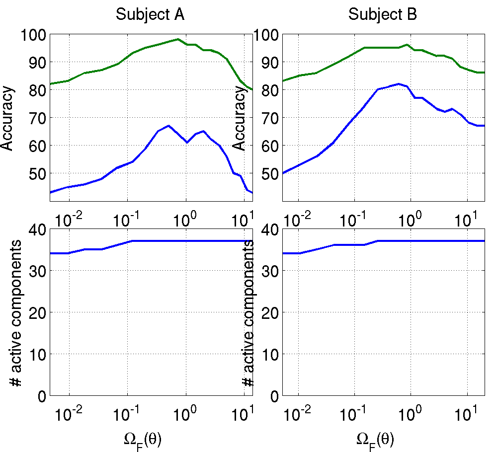
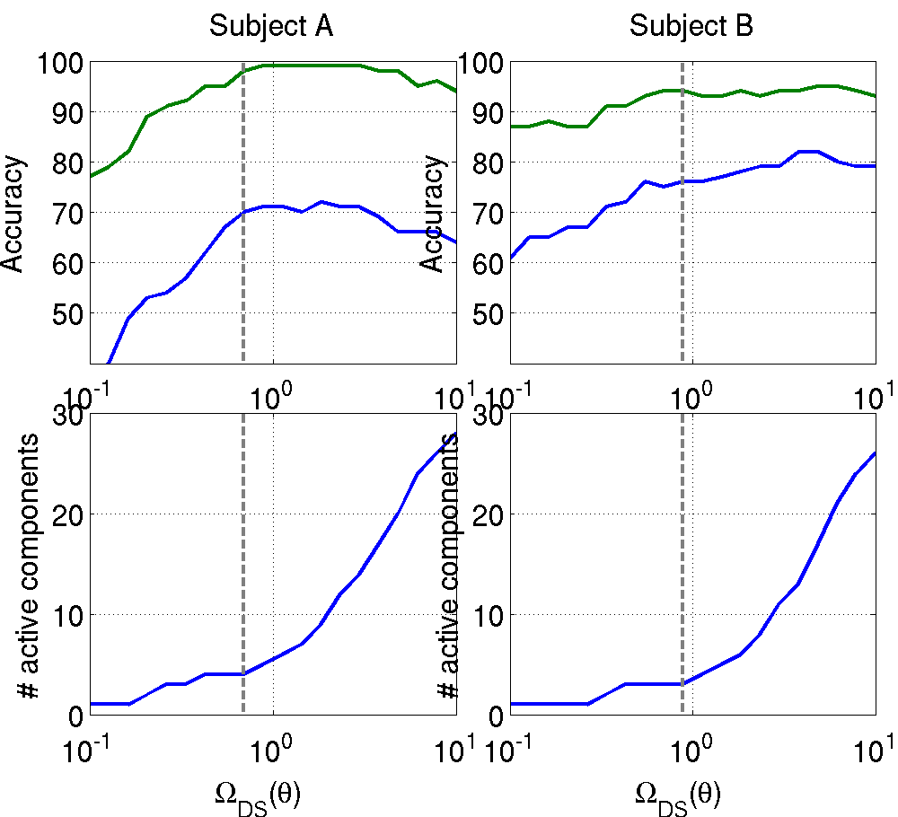

# Matlab scripts for NeuroImage paper "A regularized discriminative framework for EEG analysis with application to brain-computer interface"

## P300 experiments
Download the Wadsworth BCI data from the BCI Competition III [website](http://www.bbci.de/competition/iii/#data_set_ii).

### Frobenius norm regularization
Try
```matlab
exp_p300_xval_mnfro; % Frobenius norm
```


### Channel Selection regularizer
```matlab
cd mnl1l2
mex mnl1l2.c lbfgs.c -lut
cd ..
exp_p300_xval_mnl1l2space % Channel selection
```

### Trace norm regularization
Try
```matlab
exp_p300_xval_mnds;  % Trace norm
```

